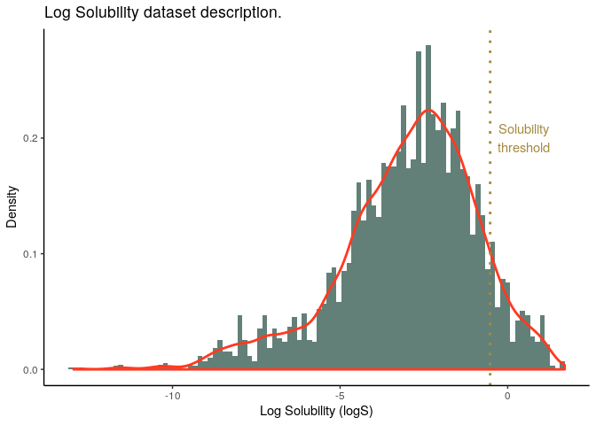
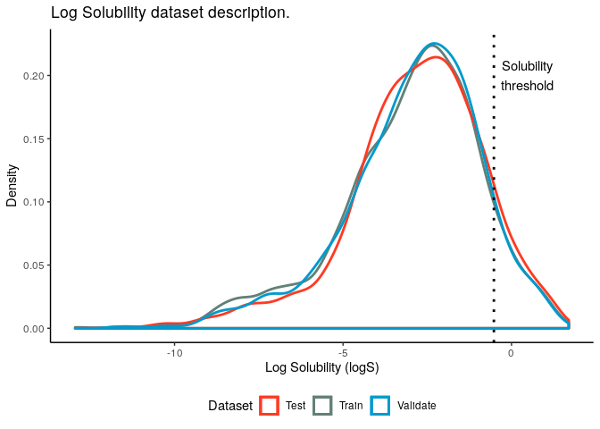

Data Description
================

## Data Description

Data is available as
[`Complete_dataset_without_duplicates`](https://raw.githubusercontent.com/RodrigoZepeda/docker-solubility/master/data_analysis/data/edited/Complete_dataset_without_duplicates.csv)
on Github.

In log solubility, the variables include:

<table>

<thead>

<tr>

<th style="text-align:right;">

minimum

</th>

<th style="text-align:right;">

q1

</th>

<th style="text-align:right;">

median

</th>

<th style="text-align:right;">

mean

</th>

<th style="text-align:right;">

q3

</th>

<th style="text-align:right;">

maximum

</th>

</tr>

</thead>

<tbody>

<tr>

<td style="text-align:right;">

\-12.95

</td>

<td style="text-align:right;">

\-4.08

</td>

<td style="text-align:right;">

\-2.68

</td>

<td style="text-align:right;">

\-2.943

</td>

<td style="text-align:right;">

\-1.54

</td>

<td style="text-align:right;">

1.7

</td>

</tr>

</tbody>

</table>

Of which 448 out of 4910 (representing 9.12 %) are above the solubility
threshold of `logS >` -0.52. For those variables their distribution is:

<table>

<thead>

<tr>

<th style="text-align:right;">

minimum

</th>

<th style="text-align:right;">

q1

</th>

<th style="text-align:right;">

median

</th>

<th style="text-align:right;">

mean

</th>

<th style="text-align:right;">

q3

</th>

<th style="text-align:right;">

maximum

</th>

</tr>

</thead>

<tbody>

<tr>

<td style="text-align:right;">

\-0.52

</td>

<td style="text-align:right;">

\-0.272

</td>

<td style="text-align:right;">

0.04

</td>

<td style="text-align:right;">

0.192

</td>

<td style="text-align:right;">

0.572

</td>

<td style="text-align:right;">

1.7

</td>

</tr>

</tbody>

</table>

The overall (adjusted) distribution is shown by the following kernel
density:
<!-- -->

We generated `train`, `test` and `validate` datasets which have the
following characteristics

<table>

<thead>

<tr>

<th style="text-align:left;">

</th>

<th style="text-align:right;">

Min.

</th>

<th style="text-align:right;">

1st Qu.

</th>

<th style="text-align:right;">

Median

</th>

<th style="text-align:right;">

Mean

</th>

<th style="text-align:right;">

3rd Qu.

</th>

<th style="text-align:right;">

Max.

</th>

<th style="text-align:right;">

Percent Soluble

</th>

<th style="text-align:right;">

Number of Molecules

</th>

</tr>

</thead>

<tbody>

<tr>

<td style="text-align:left;">

Train

</td>

<td style="text-align:right;">

\-12.95

</td>

<td style="text-align:right;">

\-4.150

</td>

<td style="text-align:right;">

\-2.691

</td>

<td style="text-align:right;">

\-2.996

</td>

<td style="text-align:right;">

\-1.552

</td>

<td style="text-align:right;">

1.70

</td>

<td style="text-align:right;">

8.995

</td>

<td style="text-align:right;">

2946

</td>

</tr>

<tr>

<td style="text-align:left;">

Test

</td>

<td style="text-align:right;">

\-11.62

</td>

<td style="text-align:right;">

\-3.917

</td>

<td style="text-align:right;">

\-2.650

</td>

<td style="text-align:right;">

\-2.822

</td>

<td style="text-align:right;">

\-1.500

</td>

<td style="text-align:right;">

1.34

</td>

<td style="text-align:right;">

9.980

</td>

<td style="text-align:right;">

982

</td>

</tr>

<tr>

<td style="text-align:left;">

Validate

</td>

<td style="text-align:right;">

\-11.62

</td>

<td style="text-align:right;">

\-3.998

</td>

<td style="text-align:right;">

\-2.640

</td>

<td style="text-align:right;">

\-2.903

</td>

<td style="text-align:right;">

\-1.550

</td>

<td style="text-align:right;">

1.13

</td>

<td style="text-align:right;">

8.656

</td>

<td style="text-align:right;">

982

</td>

</tr>

</tbody>

</table>

With adjusted kernel densities for their log solubilities as follows:
<!-- -->
