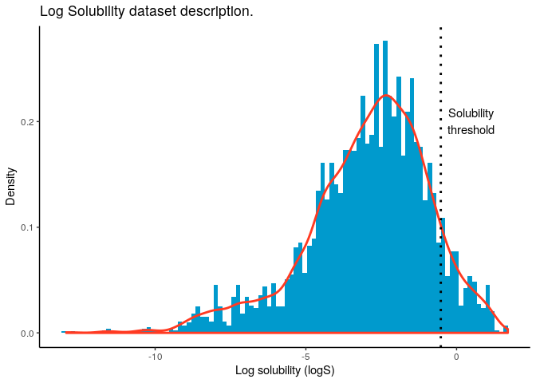

Data Description
================

## Data Description

Data is available as
[`Complete_dataset_without_duplicates`](https://raw.githubusercontent.com/RodrigoZepeda/docker-solubility/master/data_analysis/data/edited/Complete_dataset_without_duplicates.csv)
on Github.

In log solubility, the variables include:

<table>

<thead>

<tr>

<th style="text-align:right;">

minimum

</th>

<th style="text-align:right;">

q1

</th>

<th style="text-align:right;">

median

</th>

<th style="text-align:right;">

mean

</th>

<th style="text-align:right;">

q3

</th>

<th style="text-align:right;">

maximum

</th>

</tr>

</thead>

<tbody>

<tr>

<td style="text-align:right;">

\-12.95

</td>

<td style="text-align:right;">

\-4.11

</td>

<td style="text-align:right;">

\-2.7

</td>

<td style="text-align:right;">

\-2.974

</td>

<td style="text-align:right;">

\-1.568

</td>

<td style="text-align:right;">

1.7

</td>

</tr>

</tbody>

</table>

Of which 434 out of 4771 (representing 9.1 %) are above the solubility
threshold of \(\log S >\) -0.52. For those variables their distribution
is:

<table>

<thead>

<tr>

<th style="text-align:right;">

minimum

</th>

<th style="text-align:right;">

q1

</th>

<th style="text-align:right;">

median

</th>

<th style="text-align:right;">

mean

</th>

<th style="text-align:right;">

q3

</th>

<th style="text-align:right;">

maximum

</th>

</tr>

</thead>

<tbody>

<tr>

<td style="text-align:right;">

\-0.52

</td>

<td style="text-align:right;">

\-0.28

</td>

<td style="text-align:right;">

0.04

</td>

<td style="text-align:right;">

0.193

</td>

<td style="text-align:right;">

0.58

</td>

<td style="text-align:right;">

1.7

</td>

</tr>

</tbody>

</table>

The overall (adjusted) distribution is shown by the following kernel
density:
<!-- -->

We generated `train`, `test` and `validate` datasets which have the
following characteristics

<table>

<thead>

<tr>

<th style="text-align:left;">

</th>

<th style="text-align:right;">

Min.

</th>

<th style="text-align:right;">

1st Qu.

</th>

<th style="text-align:right;">

Median

</th>

<th style="text-align:right;">

Mean

</th>

<th style="text-align:right;">

3rd Qu.

</th>

<th style="text-align:right;">

Max.

</th>

<th style="text-align:right;">

Percent Soluble

</th>

<th style="text-align:right;">

Number of Molecules

</th>

</tr>

</thead>

<tbody>

<tr>

<td style="text-align:left;">

Train

</td>

<td style="text-align:right;">

\-12.95

</td>

<td style="text-align:right;">

\-4.160

</td>

<td style="text-align:right;">

\-2.730

</td>

<td style="text-align:right;">

\-3.012

</td>

<td style="text-align:right;">

\-1.600

</td>

<td style="text-align:right;">

1.70

</td>

<td style="text-align:right;">

9.012

</td>

<td style="text-align:right;">

2863

</td>

</tr>

<tr>

<td style="text-align:left;">

Test

</td>

<td style="text-align:right;">

\-11.62

</td>

<td style="text-align:right;">

\-4.000

</td>

<td style="text-align:right;">

\-2.680

</td>

<td style="text-align:right;">

\-2.903

</td>

<td style="text-align:right;">

\-1.522

</td>

<td style="text-align:right;">

1.58

</td>

<td style="text-align:right;">

9.434

</td>

<td style="text-align:right;">

954

</td>

</tr>

<tr>

<td style="text-align:left;">

Validate

</td>

<td style="text-align:right;">

\-11.62

</td>

<td style="text-align:right;">

\-4.079

</td>

<td style="text-align:right;">

\-2.632

</td>

<td style="text-align:right;">

\-2.930

</td>

<td style="text-align:right;">

\-1.528

</td>

<td style="text-align:right;">

1.58

</td>

<td style="text-align:right;">

9.015

</td>

<td style="text-align:right;">

954

</td>

</tr>

</tbody>

</table>

With adjusted kernel densities for their log solubilities as follows:
<!-- -->
