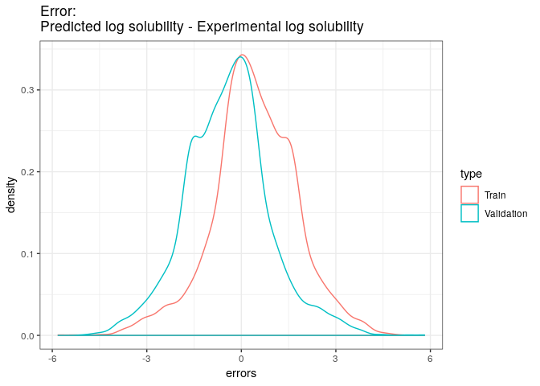

Kernel Ridge Regression
================

## Model Description

Here goes the model explanation

## Model metrics

Several models were fitted to asses convergence. R² was used as the
model’s metric.

| metrics | result\_scores | train\_scores |
| :------ | -------------: | ------------: |
| r2      |      0.9770303 |     0.9901455 |
| mse     |      0.0324305 |     0.0146346 |

The following kernel\_density compares the errors in both the training
and the validation
sets:

|         | Train errors | Absolute Train errors | Validation errors | Absolute Validation errors |
| ------- | -----------: | --------------------: | ----------------: | -------------------------: |
| Min.    |  \-5.8148477 |             0.0000007 |       \-4.9516050 |                  0.0000003 |
| 1st Qu. |  \-0.3581560 |             0.3697179 |       \-1.3191353 |                  0.3693080 |
| Median  |    0.3811410 |             0.8562427 |       \-0.3958962 |                  0.8632514 |
| Mean    |    0.4135176 |             1.0756115 |       \-0.4332338 |                  1.0807340 |
| 3rd Qu. |    1.2998505 |             1.5668530 |         0.3353658 |                  1.5725122 |
| Max.    |    4.9515939 |             5.8148477 |         5.8147687 |                  5.8147687 |

<!-- --> \#\#
Example You can run the model via the following
    command:

    docker run --rm -v ~/PATH/TO_FILE/YOU_WANT_TO_WORK_ON/:/data docker-solubility KRR

## See also

  - [User’s
    manual](https://github.com/RodrigoZepeda/docker-solubility/blob/master/Manual.md)
  - [README](https://github.com/RodrigoZepeda/docker-solubility/blob/master/README.md)
