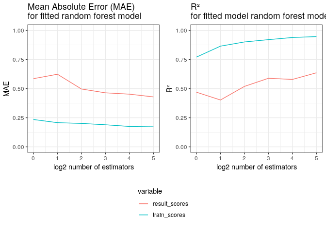

Random Forest
================

## Model Description

Here goes the model explanation

## Model metrics

Several models were fitted to asses convergence. R² was used as the
model’s metric.

<!-- -->

The following table compares the errors in both the training and the
validation sets for the model with 2^12
estimators.

|         | Train errors | Absolute Train errors | Validation errors | Absolute Validation errors |
| ------- | -----------: | --------------------: | ----------------: | -------------------------: |
| Min.    |  \-2.0953925 |             0.0000491 |       \-1.5425202 |                  0.0004009 |
| 1st Qu. |  \-0.0716674 |             0.0305225 |       \-0.1295699 |                  0.0386364 |
| Median  |    0.0055482 |             0.0692272 |       \-0.0265326 |                  0.0857289 |
| Mean    |  \-0.0072472 |             0.1147267 |       \-0.0589632 |                  0.1415152 |
| 3rd Qu. |    0.0670735 |             0.1440690 |         0.0487304 |                  0.1815203 |
| Max.    |    1.3770338 |             2.0953925 |         0.8193117 |                  1.5425202 |

## Example

You can run the model via the following
    command:

    docker run --rm -v ~/PATH/TO_FILE/YOU_WANT_TO_WORK_ON/:/data docker-solubility RandomForest

## See also

  - [User’s
    manual](https://github.com/RodrigoZepeda/docker-solubility/blob/master/Manual.md)
  - [README](https://github.com/RodrigoZepeda/docker-solubility/blob/master/README.md)
