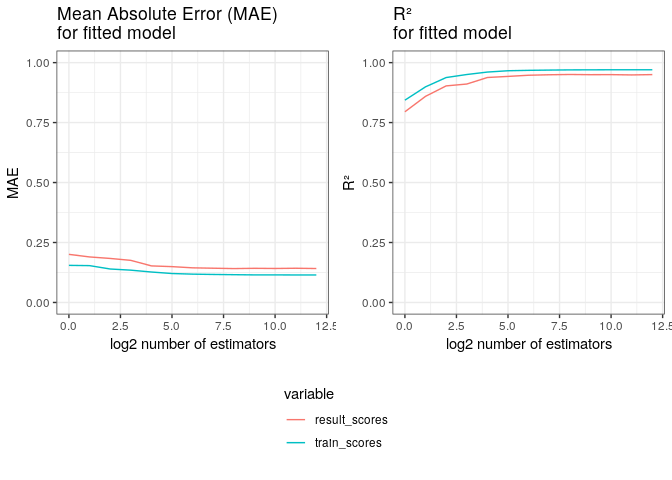

Random Forest
================

## Model Description

Here goes the model explanation

### Model parameters and code

Hola bola here should be the parameters

## Model metrics

<!-- -->

<!-- -->

## Example

You can run the model via the following
    command:

    docker run --rm -v ~/PATH/TO_FILE/YOU_WANT_TO_WORK_ON/:/data docker-solubility RandomForest

## See also

  - [User’s
    manual](https://github.com/RodrigoZepeda/docker-solubility/blob/master/Manual.md)
  - [README](https://github.com/RodrigoZepeda/docker-solubility/blob/master/README.md)
